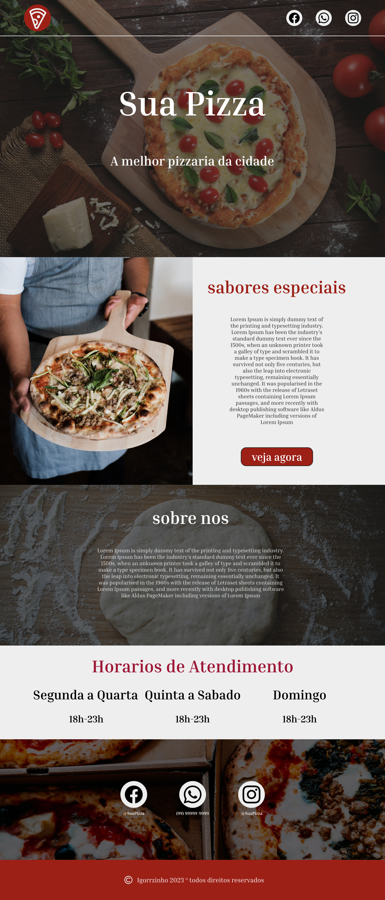

# Sua Pizza

Eu criei este site para aprimorar minhas habilidades, principalmente em Sass, que estava um tempo sem praticar. Primeiro, desenvolvi este projeto no Figma e, em seguida, coloquei a "mão na massa" para criá-lo.

## Linguagens Utilizadas

- HTML
- CSS
- SASS

## Protótipo

Inicialmente, busquei inspiração em sites como o Pinterest. Em seguida, escolhi imagens do [Pexels](https://www.pexels.com/pt-br/) e, ao final, concretizei meu design.

### veja o site!

[visite o site](https://igorrzinho.github.io/sua-pizza/)
